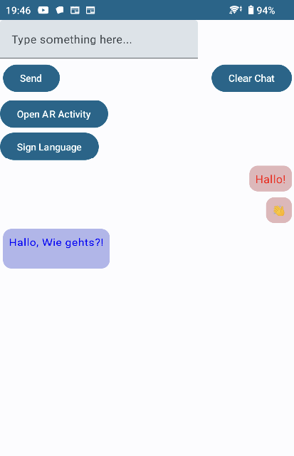

# Chat Support App

 

SignLanguage is an Android app developed using the Kotlin language and Jetpack Compose. The primary aim of the app is to facilitate real-time communication, taking advantage of Firebase's real-time database capabilities. Additionally, the app interfaces with a web application for a seamless chat experience.
---

## Connecting to Firebase:

1. **Open Android Studio**: Start your project or open an existing project.

2. **Navigate to Tools**: In the top menu, you'll find the `Tools` option. Hover over it to see a dropdown menu.

3. **Connect to Firebase**: From the dropdown, select `Firebase`. This will open the `Assistant` window on the right side.

4. **Setup Firebase Authentication**: In the Firebase Assistant window, scroll down to find the 'Authentication' section. Click on it, then select `Email and Password Authentication`. Follow the on-screen instructions to connect your app.

5. **Add Real-time Database**: In the same Firebase Assistant window, find the `Real-time Database` section and click on it. Follow the on-screen instructions to add the real-time database to your app.

6. **Sync and Test**: Once you've added the required Firebase components, sync your project with the Gradle files. Test your app to ensure the connection to Firebase is successful.

For detailed information and troubleshooting, refer to the official Firebase documentation: [Get started with Firebase for Android](https://firebase.google.com/docs/android/setup).

---

## Features:

- **Real-time Chatting:** Users can type and send messages in real-time. Messages sent from the Android app are prefixed with "Kotlin", making it easier to identify the source of the message.

- **AR Activity:** Apart from chat, the app offers AR capabilities, where users can tap on a button to open the AR Activity. In order to integrate the AR then visit this Sdk which is the source of this Ar code (https://github.com/princeku07/AR-Menu-App---Android-Jetpack-Compose-)

- **Chat Management:** Users can clear the entire chat with a single click.

- **Themed UI:** The app uses the Jetpack Compose theming to offer a user-friendly interface.

- **Integrated with Firebase:** The app uses Firebase's real-time database to store and sync messages in real-time. Any changes made to the database reflect instantly across all clients, including the associated web application.

---

## Technical Details:

- **Firebase Real-time Database:** The app connects to Firebase using a predefined database URL and uses the database reference "messages" to read, write, and listen for real-time updates.

- **Jetpack Compose:** The UI is built using Jetpack Compose, providing a modern, fully declarative UI design pattern.

- **Two-way Communication:** Messages sent from the Android app are prefixed with "Kotlin", whereas messages received from other sources (like a web app) are assumed to be prefixed with "React".

- **UI Previews:** The app's UI can be previewed in Android Studio's design editor, thanks to the @Preview annotations.

---

## How to Use:

1. Launch the app to see the main chat screen.
2. Type your message in the provided text field.
3. Press "Send" to send the message. Messages from the Android app will appear on the left side of the chat window, while messages from other sources will appear on the right.
4. Click "Clear Chat" to delete all chat messages.
5. To access the AR functionalities, tap on "Open AR Activity".

---

## Web Application Repository:

For details on the associated web application for this Android app, please refer to the following repository: [Chat Web App on GitHub](https://github.com/Mahmoud-Machlab/chatWebApp).

